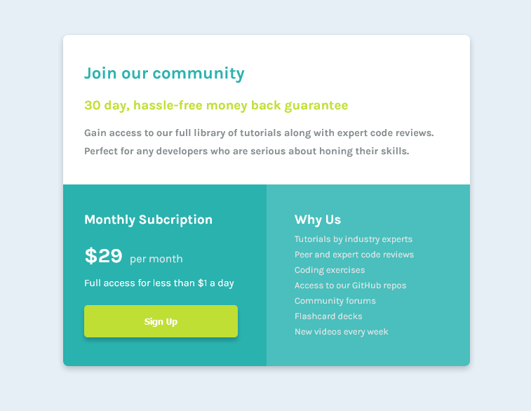

# Frontend Mentor - Single price grid component solution

This is a solution to the [Single price grid component challenge on Frontend Mentor](https://www.frontendmentor.io/challenges/single-price-grid-component-5ce41129d0ff452fec5abbbc). Frontend Mentor challenges help you improve your coding skills by building realistic projects. 

## Table of contents

- [Overview](#overview)
  - [The challenge](#the-challenge)
  - [Screenshot](#screenshot)
  - [Links](#links)
- [My process](#my-process)
  - [Built with](#built-with)
  - [What I learned](#what-i-learned)
  - [Continued development](#continued-development)
  - [Useful resources](#useful-resources)
- [Author](#author)
- [Acknowledgments](#acknowledgments)

## Overview

### The challenge

Users should be able to:

- View the optimal layout for the component depending on their device's screen size
- See a hover state on desktop for the Sign Up call-to-action

### Screenshot



### Links

- Solution URL: [Add solution URL here](https://github.com/kalush89/single-price-grid-component)
- Live Site URL: [Add live site URL here](https://kalush89.github.io/single-price-grid-component/)

## My process

### Built with
- CSS custom properties
- Flexbox
- Mobile-first workflow
### What I learned

Use this section to recap over some of your major learnings while working through this project. Writing these out and providing code samples of areas you want to highlight is a great way to reinforce your own knowledge.

To see how you can add code snippets, see below:

```html
<h1>Some HTML code I'm proud of</h1>
```
```css
.proud-of-this-css {
  color: papayawhip;
}
```
```js
const proudOfThisFunc = () => {
  console.log('🎉')
}
```

### Continued development

Wish to focus on the following concepts in the future
- Flexbox
- CSS custom properties
- Mobile-first workflow

### Useful resources

- [Normalize.css](https://necolas.github.io/normalize.css/8.0.1/normalize.css) - This helped me for fix an issue with the button element in Firefox. I will use this resourse going forward.
- [Flexbox](https://developer.mozilla.org/en-US/docs/Web/CSS/CSS_Flexible_Box_Layout/Basic_Concepts_of_Flexbox) - Helped alot. I'd recommend it to anyone still learning this concept.

## Author

- Frontend Mentor - [@kalush89](https://www.frontendmentor.io/profile/@kalush89)


## Acknowledgments

Big thanks to the Frontend Mentor team for the oppotunity to learn Front-end development wth such ease. This is the perfect place to be for anyone that aspires to become proficient in the required Front-end tools.

